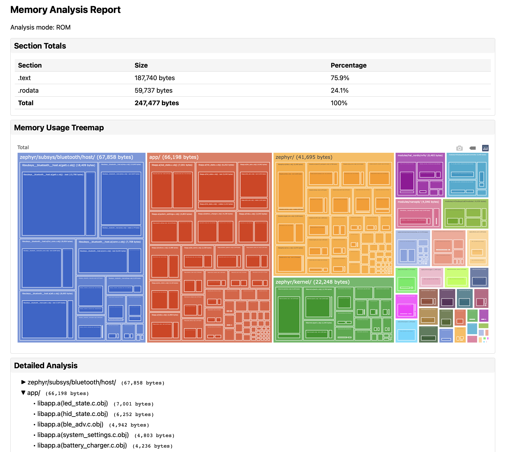
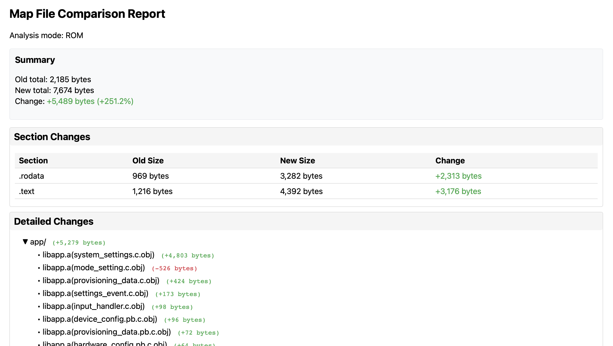

# Zephyr Tools

This directory contains tools for debugging tasks I've needed to perform on Zephyr projects.

## Table of Contents
- [License](#license)
- [Tips for Memory Analysis](#tips-for-memory-analysis)
- [Tools](#tools)
  - [analyse_map_file.py](#analyse_map_filepy)
    - [Purpose](#purpose)
    - [Usage](#usage)
    - [Options](#options)
    - [HTML Report Features](#html-report-features)
    - [Requirements for HTML Reports](#requirements-for-html-reports)
    - [Example HTML Report Usage](#example-html-report-usage)
    - [Output Example](#output-example)
  - [compare_size_trees.py](#compare_size_treespy)
    - [Purpose](#purpose-1)
    - [Usage](#usage-1)
    - [Options](#options-1)
    - [Output Example](#output-example-1)
  - [compare_map_files.py](#compare_map_filespy)
    - [Purpose](#purpose-2)
    - [Usage](#usage-2)
    - [Options](#options-2)
    - [HTML Report Features](#html-report-features-1)
    - [Example HTML Report Usage](#example-html-report-usage-1)
    - [Output Example](#output-example-2)
    - [Section Types](#section-types)
  - [bus_fault_debug.sh](#bus_fault_debugsh)
    - [Purpose](#purpose-3)
    - [Usage](#usage-3)
    - [ELF File Locations](#elf-file-locations)
    - [Example](#example)
    - [Requirements](#requirements)
    - [Tips for Bus Fault Debugging](#tips-for-bus-fault-debugging)
- [Shared Modules](#shared-modules)
  - [map_file_utils.py](#map_file_utilspy)
    - [Features](#features)
    - [Usage](#usage-4)
    - [Section Types](#section-types-1)

## License

These tools are released under the MIT License. See the [LICENSE](LICENSE) file for details.

You are free to:
- Use commercially
- Distribute
- Modify
- Private use

Under the following conditions:
- Include the original license and copyright notice

## Tips for Memory Analysis

1. Use `compare_size_trees.py` for a high-level view of memory usage by component/directory
2. Use `compare_map_files.py` for detailed symbol-level analysis, or if the link step fails due to overflow (so Zephyr's ROM_MAP or RAM_MAP tools don't work)
3. Use `analyse_map_file.py` to find memory usage hotspots in a single build:
   - Use `--mode rom` to focus on flash usage
   - Use `--mode ram` to focus on RAM usage
   - Use `--min-size` to filter out small symbols
   - Use `--by-symbol` to find duplicated symbols across objects
4. Look for:
   - Large individual symbols (functions or data)
   - Patterns of growth in specific directories
   - Unexpected additions or changes
   - Duplicated symbols across multiple objects
5. Common optimization targets:
   - Large string constants in .rodata
   - Debug/logging code in .text
   - Uninitialized arrays in .bss
   - Initialized global variables in .data
   - Duplicated functions (consider moving to shared libraries)

## Tools

### analyse_map_file.py

A tool for analyzing memory usage in a single map file, helping identify memory usage hotspots and optimization opportunities.

### Purpose
- Analyzes memory usage from a map file
- Shows section totals with percentages
- Can focus on either ROM or RAM sections
- Groups symbols by object and section
- Can group identical symbols across all objects
- Sorts by size to identify "worst offenders"
- Can generate interactive HTML reports with visualizations

### Usage
```bash
python3 analyse_map_file.py zephyr.map [--mode rom|ram] [--min-size BYTES] [--by-symbol] [--html FILE]
```

### Options
- `--mode rom|ram`: Show only ROM (.text, .rodata) or RAM (.data, .bss, .noinit) sections
- `--min-size BYTES`: Only show symbols larger than this size
- `--by-symbol`: Group identical symbols across all objects (helps find duplication)
- `--html FILE`: Generate an interactive HTML report with visualizations

### HTML Report Features
The HTML report (`--html` option) provides an interactive visualization of memory usage:



1. **Section Totals**
   - Table view of all sections with sizes and percentages
   - Total memory usage summary

2. **Interactive Treemap**
   - Hierarchical visualization of memory usage
   - Click to zoom into specific parts
   - Hover for detailed information
   - Shows:
     - Directory structure
     - Object files
     - Sections within objects
     - Individual symbols

3. **Detailed Tree View**
   - Expandable/collapsible tree structure
   - Shows full hierarchy:
     - Directories
     - Object files
     - Sections
     - Symbols with sizes
   - Easy to navigate large codebases

### Requirements for HTML Reports
To use the HTML report feature, install the required packages:
```bash
pip install -r requirements.txt
```

### Example HTML Report Usage
```bash
# Basic HTML report
python3 analyse_map_file.py zephyr.map --html report.html

# ROM-only HTML report
python3 analyse_map_file.py zephyr.map --mode rom --html rom_report.html

# RAM analysis with symbol grouping
python3 analyse_map_file.py zephyr.map --mode ram --by-symbol --html ram_report.html
```

### Output Example
```
Section Totals:
--------------------------------------------------------------------------------
.text                     524288 bytes  (65.5%)
.rodata                   180224 bytes  (22.5%)
.data                      32768 bytes   (4.1%)
.bss                       63488 bytes   (7.9%)
--------------------------------------------------------------------------------
Total ROM size: 800,768 bytes

Largest Symbols by Object and Section:
--------------------------------------------------------------------------------
app/
  main.c (65,536 bytes)
    .text (45,056 bytes)
      main                                  8192 bytes  (18.2%)
      process_data                         4096 bytes   (9.1%)
    .rodata (20,480 bytes)
      string_table                        16384 bytes  (80.0%)
```

Or with `--by-symbol`:
```
Largest Symbols (across all objects):
--------------------------------------------------------------------------------
string_table                                        16384 bytes  (20.0%)
main                                                8192 bytes  (10.0%)
process_data                                        4096 bytes   (5.0%)
```

### compare_size_trees.py

A tool for comparing memory usage between two builds by analyzing the tree output from Zephyr's ROM_MAP or RAM_MAP tools.

### Purpose
- Analyzes memory consumption differences between two builds
- Shows hierarchical view of memory usage by path
- Helps identify which components are contributing to size changes
- Works with both ROM (flash) and RAM reports

### Usage
```bash
# Generate trees for both builds first:
# For ROM analysis:
west build --build-dir build_old -t rom_report > rom_report_old.txt
west build --build-dir build_new -t rom_report > rom_report_new.txt

# For RAM analysis:
west build --build-dir build_old -t ram_report > ram_report_old.txt
west build --build-dir build_new -t ram_report > ram_report_new.txt

# Compare the trees
python3 compare_size_trees.py old_report.txt new_report.txt [--show-unchanged]
```

### Options
- `--show-unchanged`: Include entries that haven't changed in size

### Output Example
```
Total usage change: +100 bytes (+9.8%)
Old total: 1024 bytes
New total: 1124 bytes

Detailed changes:
app/                                    (changed: Old: 1024, New: 1124, Diff: +100)
  ├── main.c                           (changed: Old: 512, New: 552, Diff: +40)
  └── module/                          (changed: Old: 512, New: 572, Diff: +60)
      └── feature.c                    (changed: Old: 512, New: 572, Diff: +60)
```

### compare_map_files.py

A tool for analyzing memory usage differences between two builds by comparing their map files. Provides detailed analysis of both ROM (flash) and RAM usage at the symbol level.

### Purpose
- Compares symbol sizes between two map files
- Groups changes by directory and object file
- Can focus on either ROM or RAM usage
- Sorts by impact to easily identify "worst offenders"

### Usage
```bash
python3 compare_map_files.py old_map.map new_map.map [--mode rom|ram] [--show-unchanged] [--html FILE]
```

### Options
- `--mode rom|ram`: Show only ROM-related sections (.text, .rodata) or RAM-related sections (.data, .bss, .noinit)
- `--show-unchanged`: Include symbols that haven't changed in size
- `--html FILE`: Generate an interactive HTML report with visualizations

### HTML Report Features
The HTML report (`--html` option) provides an interactive visualization of memory usage differences:



1. **Summary**
   - Total size changes with percentages
   - Section-by-section comparison

2. **Section Changes**
   - Table view showing old and new sizes
   - Size differences with color coding
   - Positive changes in green
   - Negative changes in red

3. **Detailed Changes**
   - Collapsible tree view of all changes
   - Organized by:
     - Directory
     - Object file
     - Section
     - Symbol
   - Color-coded changes:
     - Added symbols (green)
     - Removed symbols (red)
     - Changed symbols (blue)
   - Shows size differences at every level

### Example HTML Report Usage
```bash
# Basic HTML report
python3 compare_map_files.py old.map new.map --html report.html

# ROM-only HTML report
python3 compare_map_files.py old.map new.map --mode rom --html rom_changes.html

# RAM analysis with unchanged symbols
python3 compare_map_files.py old.map new.map --mode ram --show-unchanged --html ram_full.html
```

### Output Example
```
Section Totals:
--------------------------------------------------------------------------------
.text                 +256 bytes
.rodata              -32 bytes
--------------------------------------------------------------------------------
Total ROM size difference: +224 bytes

Showing only ROM sections. Sorted by impact (largest changes first).

├── app/ (+256 bytes)
│   └── libapp.a(system_settings.c.obj) (+256 bytes)
│       └── .text (+256 bytes)
│           ├── parse_uint                    [CHANGED] Old:    40 New:    52 Diff: +12
│           └── send_settings_change_event    [ADDED]           New:    34 Diff: +34
```

### Section Types
- ROM sections:
  - `.text`: Code/instructions
  - `.rodata`: Read-only data (constants)
- RAM sections:
  - `.data`: Initialized data
  - `.bss`: Uninitialized data
  - `.noinit`: Non-initialized data

### bus_fault_debug.sh

A utility script for debugging bus faults in embedded systems by converting fault addresses to source code locations.

### Purpose
- Helps debug hard faults and bus faults in embedded systems
- Converts fault addresses to source code file and line numbers
- Can use a specific ELF file or automatically find one in build directories
- Works with any ARM-based embedded system (including Zephyr RTOS)

### Usage
```bash
# Method 1: Let the script find the ELF file
./bus_fault_debug.sh

# Method 2: Specify the ELF file path directly
./bus_fault_debug.sh path/to/zephyr.elf
```

The script will then prompt you for the fault address (in hex with 0x prefix).

### ELF File Locations
The ELF file (zephyr.elf) is typically found in one of these locations:
1. In Zephyr builds:
   ```
   build_<board>/application/zephyr/zephyr.elf
   ```
2. In Nordic SDK builds:
   ```
   build_<board>/zephyr/zephyr.elf
   ```
3. Other common locations:
   ```
   out/zephyr.elf
   build/zephyr.elf
   ```

### Example
```bash
# Using automatic ELF file detection
$ ./bus_fault_debug.sh
Using ELF file: build_nrf52840dk/application/zephyr/zephyr.elf
Enter the "Faulting instruction address" (hex with prefix 0x): 0x12345678
Fault location:
../src/modules/system_controller.c:123

# Specifying ELF file directly
$ ./bus_fault_debug.sh build_nrf52840dk/application/zephyr/zephyr.elf
Enter the "Faulting instruction address" (hex with prefix 0x): 0x12345678
Fault location:
../src/modules/system_controller.c:123
```

### Requirements
- ARM toolchain (specifically `arm-none-eabi-addr2line`)
- ELF file must be built with debug symbols

If `arm-none-eabi-addr2line` is not found, you can:
1. Add the ARM toolchain to your PATH, or
2. Source the Zephyr environment:
   ```bash
   # If using Zephyr directly:
   source ${ZEPHYR_BASE}/zephyr-env.sh
   
   # If using Nordic Connect SDK:
   source /opt/nordic/ncs/v2.x.x/zephyrsdk/zephyr-env.sh
   ```

### Tips for Bus Fault Debugging
1. Get the fault address from your crash log or debugger output
2. Make sure you're using the ELF file that matches your firmware
3. Ensure the build includes debug symbols (default for development builds)
4. The address should be in hex format with '0x' prefix
5. If the output shows `??:0`, it means:
   - The address is invalid
   - The ELF file doesn't match the running firmware
   - The build doesn't include debug symbols

## Shared Modules

### map_file_utils.py

A shared module containing utilities for parsing and analyzing map files.

### Features
- Map file parsing with support for:
  - Multi-line symbol entries
  - Section and symbol names
  - Object paths
  - Size information
- Section filtering for ROM/RAM analysis
- Directory-based grouping
- Size calculation utilities

### Usage
```python
from map_file_utils import parse_map_file, filter_sections, group_by_directory

# Parse a map file
objects = parse_map_file("zephyr.map")

# Filter for ROM sections only
rom_objects = filter_sections(objects, mode="rom")

# Group by directory
grouped = group_by_directory(rom_objects)
```

### Section Types
- ROM sections:
  - `.text`: Code/instructions
  - `.rodata`: Read-only data (constants)
- RAM sections:
  - `.data`: Initialized data
  - `.bss`: Uninitialized data
  - `.noinit`: Non-initialized data
